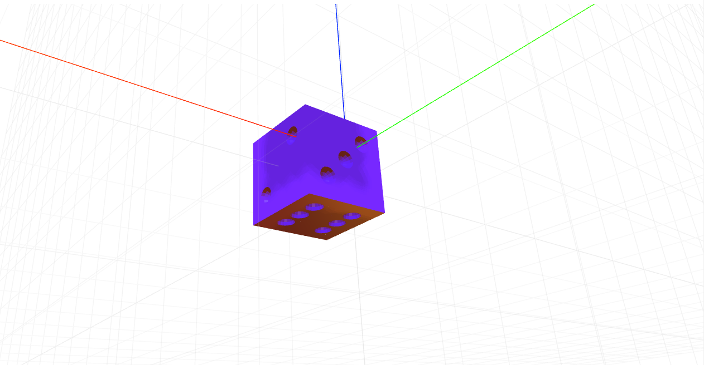
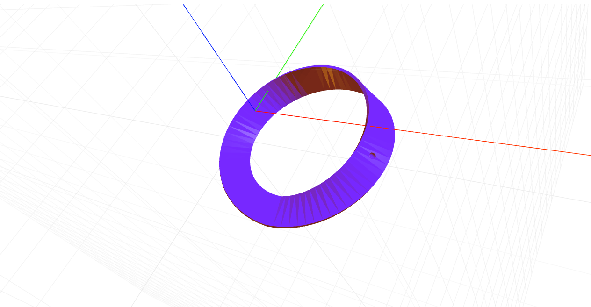
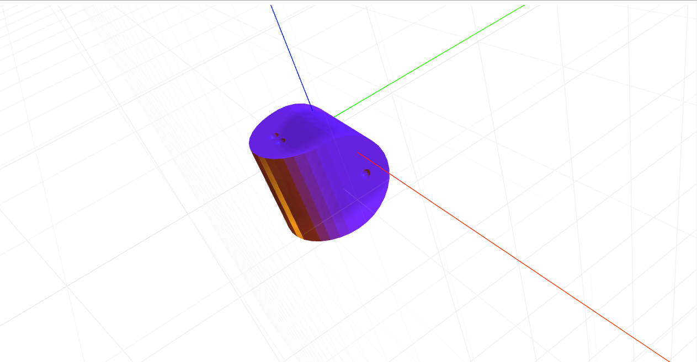

# craft-dice

#Install
`$ npm install craft-dice`

#Parameters
`numberOfSides - determines how many sides the die has.`

#Example

```html
<craft>
	<craft name="die" module="craft-dice"/>
	<die numberOfSides="6"></die>
</craft>
```



